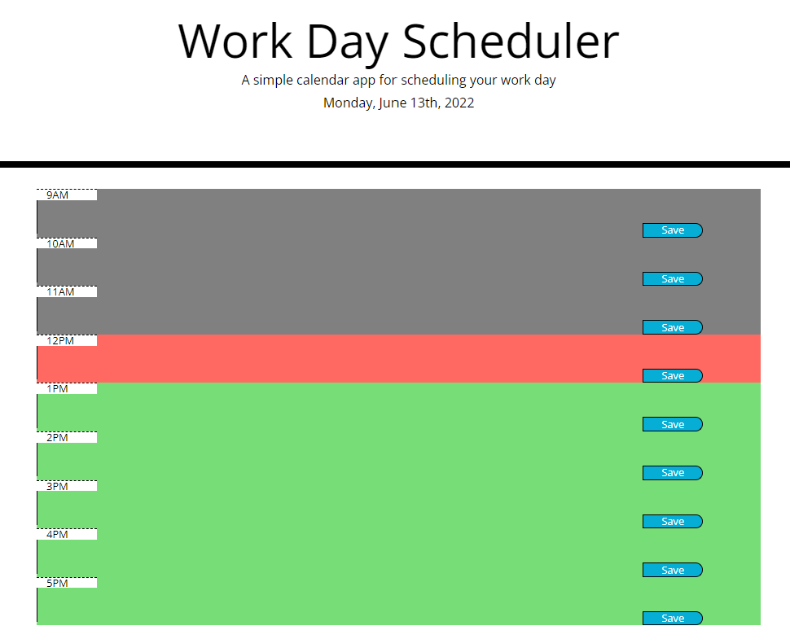
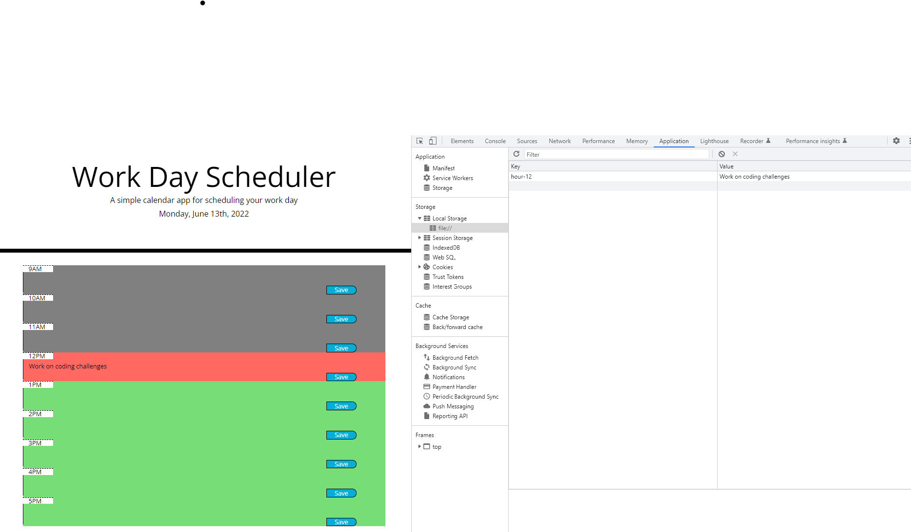

# Work Day Scheduler
## Description

This project is aimed to develop a work day scheduler that enables a user to input events for each hour of the day.

## Work Performed

### <ins>User-friendly web interface</ins>

The application shows current date. The time blocks show different colors that represent past, now, and future times.

### <ins>Local storage of user input </ins>

The user is able to input events in the text boxes. After clicking "Save", the input text will be stored in local storage and will still appear after refreshing the page.

## Link to Work

[GitHub](https://github.com/xzhw39/edward-xu-jupiter)

[Deployed Website](https://xzhw39.github.io/edward-xu-jupiter/)

